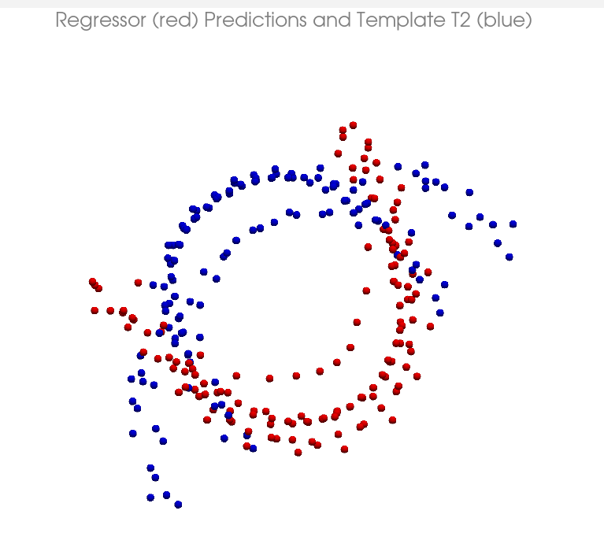
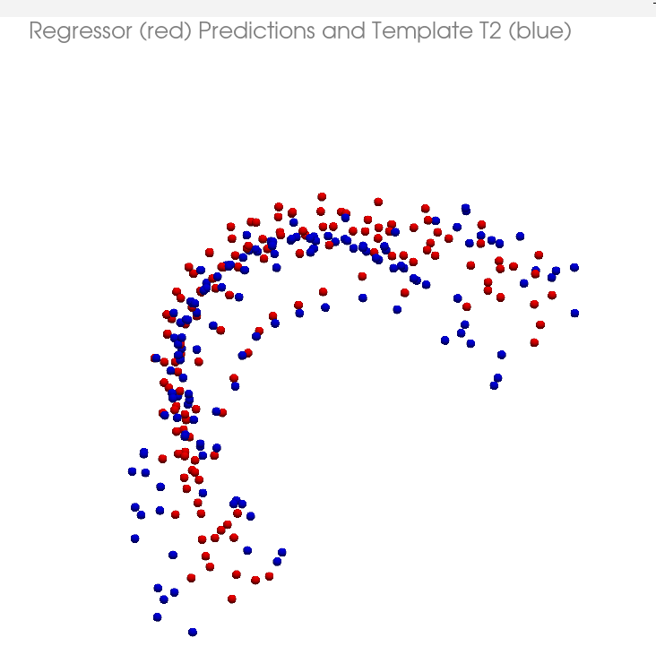
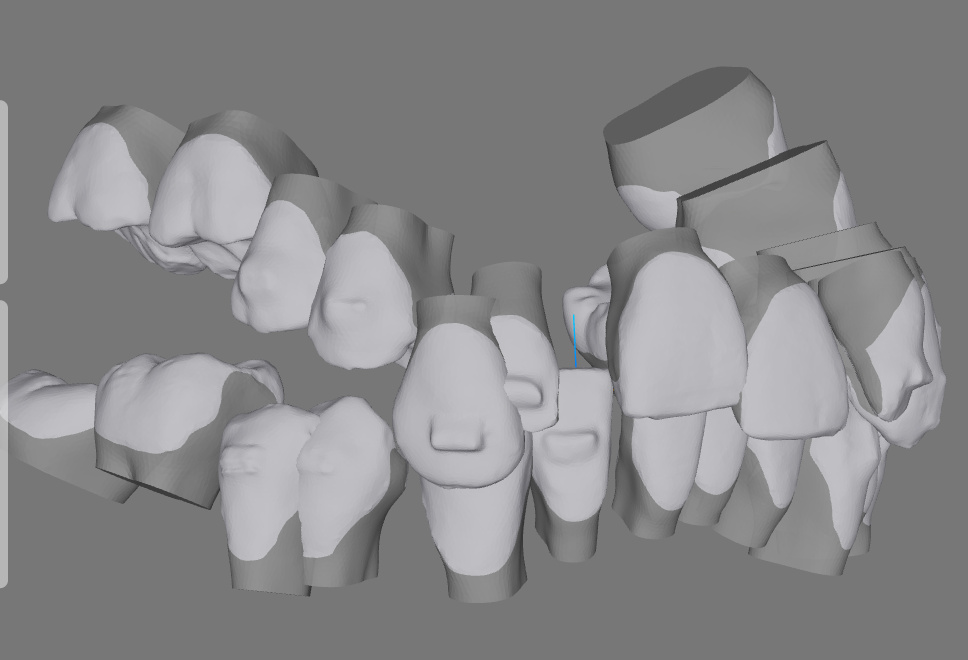
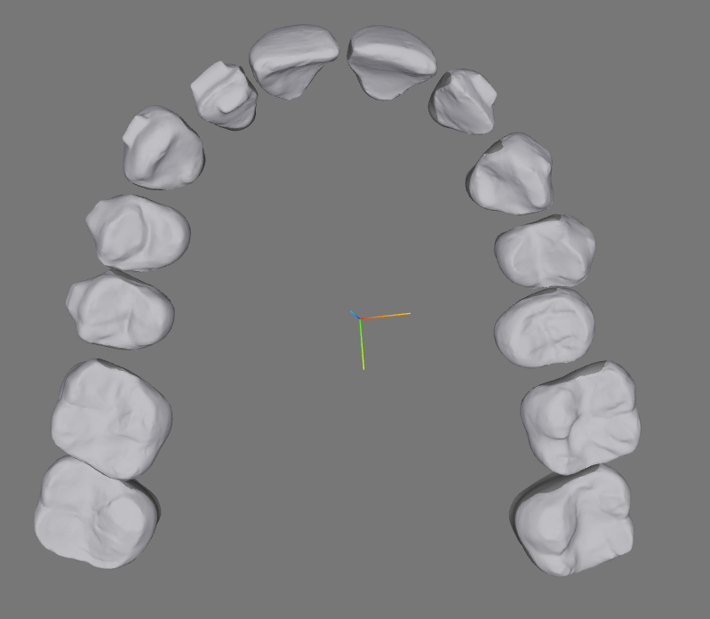

TODO
    DONE кнопки вида и режима. 
    DONE привязать слайдер к стейджам
    DONE загрузку файла oas
    $ статус бар сделать - почти готово с оговоркой что пока отслеживает только работу фронта 
        но не показывает статус Loading во время работы бека. ну  пока остаим как есть
    DONE  сделать кнопки рядом со статус баром для быстрой перемотки к T1 и T2 (вмержил в майн). 

приступаем уже к инференсу. 
    DONE и тут нарисовалась проблема... 
        я пытаюсь использовать в качестве входных данных для предикта jsonStagingData. но там данные в формате 
        translation/rotation. а для рендеринга нужны translation/quaternion. 
        и я их запуская предикт перекопирую как есть 
        - решение нужно был оприменить rt

    DONE и тут внезапно... а что делает handlePredictT2 в ToothPlacement? 
        может его в Ortho? - переместил в Ortho. predict теперь модифицирует orthoData

    DONE проблема - предикт кривой: 
        как решать - надо на одном кейсе проверять выдачу сначала точек, потом трансформов, сравнивать
        наблюдение - предикт выдает точки а потом model_inference выдает трансформы. 
        есть подозрение что последовательность зубов в выдаче неправильная - предикт выдает зубы 37, 36, 25 ... а в веб я вижу 11, 12, 13....
            выход - либо на сервере делать перестановку, либо тащить dw_teeth_nums14 + up_teeth_nums14 во фронт. вопрос открыт, с пятницей.
            сделаю на беке пока...
            дебажим : в get_prediction вместо предикта выводим t2 : return base_case_points_t2, base_case_points_t1, regress_loss # DEBUG!!!!!!!!!!!!!!! 
            видим ту же пургу. значит проблема не в предикте... следующая версия - проблема в get_transforms. 
                там 2 перобразования - calc_transform_matrix_fr_points которая есть кабш и проверена временем, 
                но тем не менее ее не мешает проверить, если вместо предикта выдавать t1, то матрицы должны быть все единичныим. и да, они единичные. 
                и трансформы в случае t1 нулевые. но не в случае с t2, 
                где движения по для резцов уже конские. 
            теперь внимание - если использую t1, то все зубы в центре, 
            т.е они не умножены на relative teeth transforms. 
            вот где собака порылась. 
        итог - сделал все трансформы на беке, работает.
    что дальше - 
        - сделать разрешение коллизий? наверное это рано, т.к. изначальная мысль была 
            проверить как работает предикт на разных темплейтах. 
            при этом можно грузить кейс как сейчас, а можно и точки темплейта сохранить. 
        - сделать возможность применять разные темплейты. 
            - подумать как это может выглядеть в UI...
            - внезапно выяснилось что вместо сохранения наборов темплейов можно грубо редактировать отдельные зубы для корректировки темплейта. 
            
        - DONE ок. теперь в LeftPanel добавим кнопку, назовем ee init Predict. по этой кнопке будем вызывать только predict init.
        - DONE чтобы легче жилось, надо отрефакторить ToothPlacement, a то он не очень solid - все подряд делает. 

        - DONE а еще надо рефакторить бек - OrthoInferencePipeline 2 метода 
            содержат много повторяющегося кода. 
    эксперимент: 1 базовый кейс, много темплейтов, 

        суть - проверить как это работает. 
        как это отобразить? варианты
            - скриншоты в таблице. 1 кадр вход t1, темплейт, результат, коммент.
        - что еще написать в конфле - при всех эволюциях модель делает
            нормально базовые вещи, овербайт, оверджет, и т.п.
        - попробовать удалить зуб - что будет? - в t1 он не удаляется. хз чо 
            будет - надо искать кейсы с пропущенными зубами. 
    - наблюдение: если кейс во фронте показывается задом наперед (103931) то 
        изменения темплейта для него оказываются инверсными, что как бы намекает что проблема на стороне фронта. и это так, на фронте решилось правильным заданием трансляций и ротаций 
        -см. const { jsonT1Vec3, jsonT2Vec3, jsonStageVec3 } = useMemo(() => { в ToothPlacement.
            но для кейсов, где поворот челюсти изначально ненулевой, проблема с предиктом сохраняется. 
        тупо убиранием в model_inference run_t2_predict
        # Prepare template input (invert x and y) wich is strange behaviour!!!! check frontend!!!
        # template_input = template_input.copy()
        # template_input[..., 0] *= -1
        # template_input[..., 1] *= -1
        проблема не решается а переносится с одних кейсов на другие. 
        видимо надо в _compose_transforms_from_points добавлять трансформации для челюстей... либо смотреть на реализацию во фронте, что может быть предпочтительнее в моем контексте, т.к. придется тащить в классы предсказания еще и трансформы челюстей. 
        - похоже проблема в том, что когда сравниваешь точки разных кейсов, в качестве входа и темплейта, нельзя не учитывать трансформ челюсти. 
            при учебе это похоже не важно, но для разных кейсов - да. и похоже в предикт надо подавать точки затрансформленные с челюстью. 
        -- и тут нарисовывается мощная проблема: точки после такого предикта выйдут с трансформом челюсти. и что с ними тогда делать?
        такой проблемы нет, если делаем просто init_predict, все нормально работает.
        - может надо попробовать схему без формирования json файла с трансформами и 
            брать всё из кейса? т.к. раньше данные стейджинга были нужны только во фронте. теперь они нужны и в беке тоже. 
        вмержу в main...
    - пока не начал глобальных изменений, возможно надо сделать второй эксперимент, подобрав кейсы и 
    возможно временно заблокировать jaw rotation в ToothPlacement. - так найти кейсы, с нулевым вращением челюстей и использовать только их в качестве базовых и в качестве темплейтов.
    список годных: 
        - 00000000, 120076,  
        120737 - под вопросом: у него open byte, но он изначально повернут на 90, не понятно это издержки фронта, или это jaw rotation. ( это jaw rotation) так что не годится, 
        интересно что у него при предикте с 103931_8 нижняя четверка улетает в центр. разобраться
        669069, 742608 - норм и есть expand, 1623883_1.3
    повернутые: 103391, Asunsion, Paula. 
    
    эксперимент: 2 - много базовых кейсов, один темплейт: берем сильно измененный 120076_1 в качестве темплейта: это педро кейс но арку делаем ему вообще прям овальную, но без дичи.

- наблюдение - иногда кейсы не грузятся - ошибка во фронте, похоже на незавершенность 
    загрузки -  мол нет RelativeToothTransforms . проверять. 
    проблема проявлялась только при таком сценарии - открываем кейс где много стейджей (92), а потом кейс где их меньше, 
    и в ToothPlacement сыпется максимальный stage из предыдущего кейса, для чего в Orto был засунут дикий костыль в виде 
        // Reset stage to 0 when a new case with lower stage amount is loaded (baseCaseFilename changes)
        useEffect(() => {
            setStage(0);
        }, [baseCaseFilename]);
    вообще непонятно, почему это происходит, ведь при перезагрузке кейса Ortho рендерится и stage ставится в 0...
        const [stage, setStage] = useState(0); 
    вроде потому что компонент размонтируется не полностью... 
    вообще количество ререндеринга Ortho и ToothPlacement заоблачное. надо рефакторить 
                
- NOTE - в ToothPlacement jsonT1Vec3 и jsonT2Vec3 используются только для линейного стейджинга и 
    MAPS расчетов. подумать, нужны-ли они... пока оставим чтоб ничо не сломалось....

- NOTE в предикт для вычисления loss'a подаются T2 - возможно надоотрефакторить это дело. но потом. 
- NOTE jaw_rt = mandibular_rt if tooth_id > 30 else maxillary_rt # TODO 

- теперь рефактор. суть - убрать json файл с трансформами и все трансформы включая трансформы челюсти делать на беке, см. 
    проект rapier_probe.
    DONE - 1 убрать json ( сделал, но сломались лендмарки. это потому что трансформы другого кейса подтягивал )
    DONE update backend accordingly
    - теперь predict_init выхлоп не содержит трансляций челюсти. почему? 
        - подаю на вход не транслированные в челюсть данные, т.к. беру при предикте их прямо из кейса. 
            - может это неправильно, и надо как-то брать данные которые уже прошли все преобразования один раз на беке... 
                пока не понятно.. в процессе инференса getStagingData выдает данные стейджинга в формате как раньше было в orthoData.json 
                и эти данныене являются членом класса OrthoData.
        - или так сам алгоритм работает?
    - надо сделать прозрачный OrthoInferencePipeline. сейчас выход run_init_predict возвращает  Dict["tooth_id", Dict[("rotation", "translation"), Any]] 
        - если нужно добавить к примеру в init_predict трансформ на челюсть ( для init_predict этого будет достаточно ) 

    - сначалоразобраться с init_predict а потом переносить опыт на predict_t2...
    
    - нормально в init_predict, но проблема с инверсией x и y координат сохраняется в run_t2_predict при например 
        загрузке 103931_8.4.oas и темплейте 120076_1
        - т.е. зубы в предикт t2 надо загружать в масштабе головы ( с трансформами челюстей )
            конгратс, если это сделать, то нафик предикт рассыпается. 
            - проверка отображать всё в pv и смотреть что за транслированные точки получаются. а точки в полном поряде
            - наблюдение - если все то же провернуть в init_predict, то все ок, если не делать последующий за предиктом трансформ 
                в челюсть. тут возможно и лежит проблема. 
        - развитие - предикт похоже работает правильно, если не совать точки в голову- тут темплейт намеренно искажен:
        <!--  -->
        
        и если совать, тоже норм, но уже в челюсти:
        
        
        но! если совать, то фо фронте предикт страшен:
        
        а если не совать, то 
         
        лучше, но вместо экспанда виден констрикт.... который лечится инвертированием координат x и y в предикте 
        насколько это хорошо - вопрос. надо проверить на кейсе у которого координаты челюсти повернуты на 90° а не на 180. 
            - проверка показывает что просто инверсии координат в этом случае недостаточно - прокатывает если jaw просто повернута на 180 в плоскости xy, но не прокатывает в общем случае. 
        !!!! ошибка была в run_t2_predict -> transforms_dict = self._compose_transforms_from_points(base_loader, predictions, base_case_points_t1_) где base_case_points_t1_ - не транслированные в челюсть точки.
    подготовка к выкатке - 
        свой коллижн резольвер???????? ой!!!!!
        рефакторить используя isLower 
            cm ortho_data.py и model_inference. в OrthoCase завести метод и сделать isLower используя def Py_isLower(clinicalID): return isLower(clinicalID) из OrthoDoc.pyx 
            isLower в примере работатет в model_inference - нет, вопрос как применить в model_inference - там      
                _compose_transforms_to_jaw работает со словарями трансформов - варианты: тащить в словарь признак isLower? - отложим...

        делать загрузку темплейта из UI, думать как именно.
            первая идея - кнопки выбора и по комбинации нажатых, подобрать 6 темплейтов.     

!!! NOTE см. кейс 1176689. понтики и супернумерари. есть что дорабатывать. 
    
1042950 - натурал класс 2 завалены крайние моляры возможно можно подрихтовать

1071181 - натурал класс 1

1153729 - дамон класс 1 но стремные зубы

1251217 - дамон класс 1 но кейс очень короткий и дамон под вопросом

1252111 - дамон класс 1 с одной стороны возможно с другой можно поправить

1252587 - дамон класс 2 но дикий оверджет

1252722 - пейдро класс 1 с одной стороны не явно
1253518 - дамон класс 1 но дамон не явный но его нормальным хорошо делает автосетап и можно взять. 

1251860 - параболик класс 2 но похож на дамон больше. 
1252972 - параболик класс 1 но похож на дамон 
1254952 - параболик класс 1 похож на параболик
1258342 - параболик почти класс 2 похож на параболик. 

DONE проверять темплейты. первый дамон класс 1 явно не зашел. пробовать его руками - тут выясняется что интеjaw сеть выставлять не умеет. видимо особенност обучения. 
    - при этом точки предикта в пространстве головы выглядят сносно. 
DONE делаем темплейты и насаживаем их на комбинации кнопок
NOTE!! - в папке server/templates файлы оканчивающиеся на _1 - это оригиналы в которых нет никаких предискажений. 

что дальше????? показывать это как есть может вызвать вопросы из-за дыр и коллизий.  
    прбовать делать collision-space resolver. !!!!!!!
    
    вариант - использовать редактированный t2 с помощью контролов в качестве темплейта. 
    для этого придется 

    еще хочется сделать чтобы система координат контролов зубов была привязана к зубу, а не к 
    ориентирована как глобальная. тогда может бытьне понадобится арка...
    